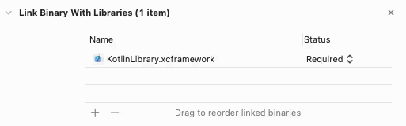

# Kotlin plugin to support Swift Package dependencies


This gradle plugin provides two-way interoperability between Kotlin dependencies and Kotlin-based Swift Package
Multiplatform.

## Add plugin

[comment]: <> (To use the plugin add a dependency in the plugins section.)

```kotlin
plugins {
    java
    kotlin("multiplatform")
    id("com.github.pagr0m.kotlin.native.spm")
}
```

## Using Swift package dependency as a Kotlin library

1. Define multiplatform targets (`macos`, `ios`, `tvos`, `watchos`).
2. Declare a `spm` section with all the necessary package dependencies for each platform.
3. Add package dependencies with URL link, version and name. This name would be used as an import in the Kotlin project.

   `build.gradle.kts` example:

   ```kotlin
   kotlin {
       macosX64()
   
       spm {
           macos("11") {
               dependencies {
                   packages(
                       url = "https://github.com/AFNetworking/AFNetworking.git",
                       version = "4.0.0",
                       name = "AFNetworking"
                   )
               }
           }
       }
   }
   ```

4. Run the `cinterop<DependencyName><PlatformName>` gradle tasks for each dependency and platform.
   ```shell
   ./gradlew cinteropAFNetworkingMacosX64
   ```

**NOTE:** At the moment, Kotlin is not directly compatible with Swift. Therefore, you can only connect Objective-C
libraries that have a Swift package file.

## Using the Kotlin library as a Swift Package dependency

To create a Kotlin library as a swift package dependency, you need to add the Kotlin multiplatform settings and specify
the name of the resulting library (this is the name that will be used during import).

1. Extend targets configuration with framework baseName (`KlibIOS` in this example. Could be any). This name would be
   used as Swift package name in XCode project.
2. Declare a `spm` section with needed platforms. Note that you can add Swift package dependencies
   too ([see first section](#using-swift-package-dependency-as-a-kotlin-library)).

   `build.gradle.kts` example:

   ```kotlin
   kotlin {
       iosArm64 {
           binaries {
               framework {
                   baseName = "KlibIOS"
               }
           }
       }
   
       spm {
           ios("11") { }
       }
   }
   ```

3. Create xcframework
   ```shell
   ./gradlew bundleXCFramework
   ```
   XCFramework will be located in `build/spmUtils/xcframework/KotlinLibrary.xcframework`
4. Connect xcframework to XCode project.

    - Option 1: via XCode GUI

      Open XCode project settings and add link to xcframework
      

    - Option 2: via `Package.swift` file

      ```swift
      // swift-tools-version:5.3 
      import PackageDescription

      let package = Package(
         name: "ExampleWithKotlinLibrary",

         products: [
            .library(
               name: "ExampleWithKotlinLibrary",
               targets: [
                  "ExampleWithKotlinLibrary",
                  "KotlinLibrary"
               ]
            )
         ],

         targets: [
            .target(
               name: "ExampleWithKotlinLibrary",
               dependencies: []
            ),

            .binaryTarget(
               name: "KotlinLibrary",
               path: "./xcframework/KotlinLibrary.xcframework"
            )
         ]
      )
      ```

--- 

### Publish xcframework to Git

0. Complete 1-3 steps in [section above](#using-the-kotlin-library-as-a-swift-package-dependency).
1. Add credentials to `local.properties` file.
   ```kotlin
   git.credentials.username = USERNAME
   git.credentials.password = PASSWORD
   git.credentials.giturl = URL_TO_GIT_REPOSITORY.git
   ```
   **NOTE:** Do not forget to add this file to `.gitignore`.

2. Run publishXCFramework task to zip and publish it.
   ```shell
   ./gradlew publishXCFramework
   ```

3. Add binaryTarget in `Package.swift` file.
      ```swift
      let package = Package(
         // some code
         
         .binaryTarget(
            name: "KotlinLibrary",
            url: "pathToGitUrl",
            checksum: "..."
         )
      )
      ```
   **NOTE:** the binaryTarget name must match with name of the xcframework that is packed into the archive. By default,
   this is `KotlinLibrary`.

## Samples
- [Kotlin Multiplatform Mobile project](https://github.com/PaGr0m/kmm-example-with-spm) using network libraries (AFNetworking for iOS, OkHttp for Android)
- [Kotlin Multiplatform Project](https://github.com/PaGr0m/kmp-example-macos-xcframework) adding Kotlin library as XCFramework to Xcode project
- [Kotlin Multiplatform Project](https://github.com/PaGr0m/kmp-example-with-spm) for macOS target with Swift Package dependency 

## Contributing

Feel free to open an issue or submit a pull request for any bugs/improvements.
